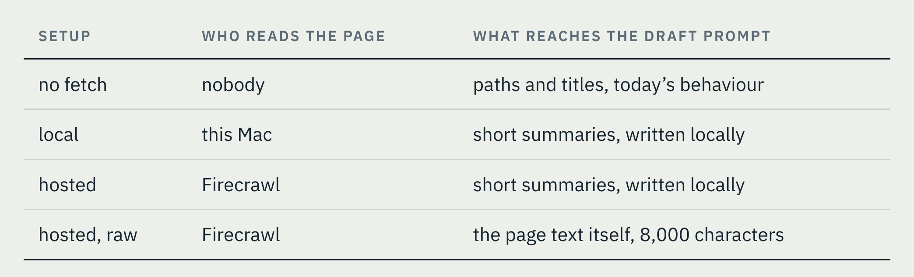
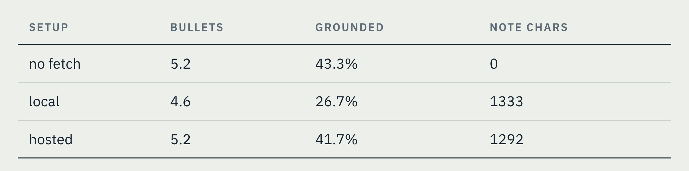
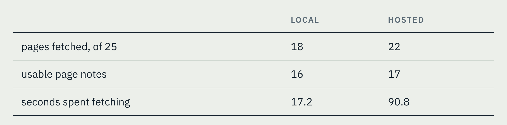
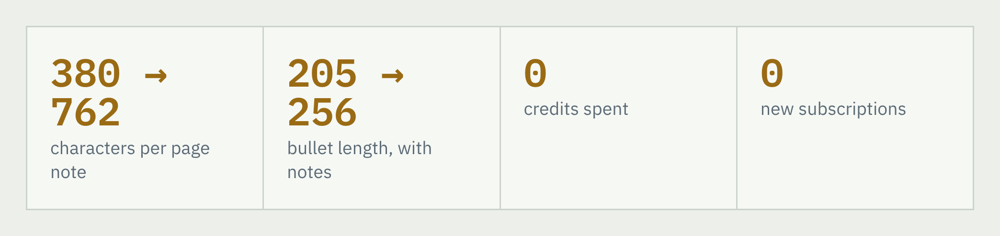

# Cheap Enough to Be Wrong

## Testing a Hypothesis Before Building On It

*Originally published at https://blog.craigdube.dev/blog/cheap-enough-to-be-wrong/*

Every morning a job reads yesterday’s Chrome history and writes an entry into an Obsidian vault. A second agent works over that vault, folding each day’s learnings in with the other sources until a concept has one page carrying everything I have run into about it, whether that came from a browser tab, a chat session, or a document three weeks ago.

That makes the daily entry the raw material for everything downstream, and for a while it had felt thin. What Chrome hands the job is a domain, a page title, and up to six page paths per site. It never sees the page itself, so the model works out the topic from the URL and writes whatever the URL will support. One entry read “looked into Gemini API models” when the page I had actually opened was a pricing change.

## The hypothesis

I thought the answer was a better reader. [Firecrawl](https://www.firecrawl.dev/) bills itself as a context API for AI agents, and its scrape endpoint promises llm-ready markdown with, in its words, “no navs, footers, or ads.” Handing my summarizer a properly extracted article instead of a URL looked certain to produce entries with real facts in them. That hypothesis is specific enough to test, and I had another session’s implementation plan in hand that assumed it was already settled. What I did with that plan was take it into Claude Code and ask how to find out, rather than asking it to build the thing.

## Four setups, and one it caught that I had missed

The plan I brought in compared today’s behaviour against a hosted fetch feeding raw page text into the draft prompt. Claude Code’s first substantive note was that this moves two levers at once, so a win would not say which lever moved it. Splitting them apart gave four setups:

*[IMAGE: table-1.png — Setup / Who reads the page / What reaches the draft prompt]*

<!-- table as text
Setup | Who reads the page | What reaches the draft prompt
no fetch | nobody | paths and titles, today’s behaviour
local | this Mac | short summaries, written locally
hosted | Firecrawl | short summaries, written locally
hosted, raw | Firecrawl | the page text itself, 8,000 characters
-->

The two I cared about were local and hosted. Everything between them is identical, so whatever the drafts differ by is the fetcher and nothing else.

The fourth setup answers a different question. My own rules say a fetched page never goes into the draft prompt as it came off the web, because whatever that prompt writes gets saved into my vault as a file, and I do not want a web page having a say in what lands there. Summarizing each page first is the guard against that. Running the raw version once was how I found out what the guard costs me.

## Making the answer trustworthy

Most of the morning went into the parts that would stop the test from telling me what I wanted to hear.

- **The days were chosen by script**, not by feel. It took the five weekdays of the prior month with the most fetchable pages in them.
- **One history gather and one fetch per day, shared by all four setups.** Otherwise I would be measuring the model’s run-to-run variance rather than the setups.
- **The drafts came out blind.** Four files per day, labelled W, X, Y and Z, shuffled per day, with the key written to a separate file I opened afterward.
- **Every new rule was proved by breaking the code on purpose** and confirming the right test went red.

Total outlay for the whole experiment was 25 Firecrawl credits and one morning. Five pages a day across five days is what set the credit number, and the two hosted setups sharing a single fetch through the cache is why running four of them did not multiply it.

## What came back

Five days, four setups, and drafts I could sit down and read side by side. The harness also scored every draft on three counts, all of them things a script can check with nobody reading anything:

- **bullets** is how many the day produced, averaged across the five days.
- **grounded** is the share of bullet headings whose exact words turn up somewhere in that setup’s own source material. If a heading names a tool that no page mentioned, the model made it up, and making things up is the risk that comes with feeding it more to read.
- **note chars** is how much page summary text went into the draft prompt to begin with.

*[IMAGE: table-2.png — Setup / bullets / grounded / note chars]*

<!-- table as text
Setup | bullets | grounded | note chars
no fetch | 5.2 | 43.3% | 0
local | 4.6 | 26.7% | 1333
hosted | 5.2 | 41.7% | 1292
-->

Those numbers cannot separate the top three, and I would not want them to. Matching words literally punishes a draft for summarizing well, so a heading like “Anthropic Loop Engineering” scores zero for saying the thing in its own words, and with five days at roughly five bullets each, a single bullet swings the column twenty points. What settled it was reading the drafts, which say nearly the same thing whichever setup wrote them.

The fourth setup settled cleanly and against the plan I had walked in with. Feeding raw page text into the draft prompt produced the least grounded bullets of anything I ran, on all five days, at 17.3% against 41.7% for the same text summarized, while spending four times the note budget and 39% more prompt tokens.

For the fetchers themselves, the hosted service read four more pages than my Mac did and only yielded one more usable note, for 25 credits and 5.3 times the wall clock, on markdown that still arrived carrying skip links, share bars and a Labor Day sale banner.

*[IMAGE: table-3.png — local / hosted]*

<!-- table as text
 | local | hosted
pages fetched, of 25 | 18 | 22
usable page notes | 16 | 17
seconds spent fetching | 17.2 | 90.8
-->

So the hypothesis was wrong. The reader was never the constraint, and paying for a better one bought nothing I could see in a draft.

> **One thing the run found that I was not testing for**
>
> A day of Chrome history is a few hundred URLs and the fetch budget is five, so something has to choose. That chooser sits in front of the fetcher, it is plain rules in Python with no model call in it, and I call it the picker.
>
> Its first version worked by rejection, throwing out anything that looked private and fetching whatever was left. Over those five days it spent 10 of its 25 picks on sign-in walls, including a hospital patient portal, and the hosted setups sent all 25 of those URLs out. Nothing private came back, because the service is not signed in as me, but several of the URLs carried ids. The rule is now an allow list, and the query string is stripped before anything leaves.

## What the drafts actually pointed at

Reading them side by side is what moved this forward, because the interesting question stopped being which fetcher won and became why none of them mattered. Tracing one article through all six stages answered it, and every problem sat downstream of the fetch.

The summarizer was capped at 60 words and asked what the page was *about*, which gives back the browser tab title. It was only ever shown 3,000 characters of a page the fetcher had kept 4,000 of, so a quarter of everything I had paid for went unread. The day’s notes were then truncated again before the draft prompt saw them.

None of that needed a third party. It needed me to ask my own local model a better question, and to give it enough of the page to answer. The prompt now asks for three to five sentences of what the page *asserts*, meaning named products, versions, numbers and the actual claim, with room for 120 words, and both limits went up to 4,000 characters.

*[IMAGE: stats-1.png — stat strip]*

<!-- stats as a list, if you skip the image
- characters per page note: 380 → 762
- bullet length, with notes: 205 → 256
- credits spent: 0
- new subscriptions: 0
-->

The difference is easier to see than to describe. Here is the same day’s security bullet, written from the same pages, before and after the change.

> **Before**
>
> Analyzed industry threat reporting on how adversarial AI adoption is reshaping enterprise security postures.

> **After**
>
> Analyzed CrowdStrike’s 2026 Global Threat Report detailing how adversaries weaponize legitimate enterprise AI tools (affecting over 90 organizations), record-setting eCrime breakout speeds, and why securing edge devices must inform AI product risk strategy.

The second one is the kind of sentence the vault can do something with. A page about ClickUp’s Business Plan gate now says which gate, and two pages about the same product read a fortnight apart finally have something in common to merge on.

The last change was to stop throwing the page summaries away. They were only ever used as material for writing the day’s bullets, and once the bullets were written they were deleted, so anything in a summary that did not fit into a bullet was lost. The entry now carries a **Pages Read** section as well, one line per page, summary intact.

Here is one of those lines, exactly as it went into the entry.

> **Pages Read: Tavily MCP Server**
>
> Tavily provides a remote MCP server accessible via URL using an API key or OAuth authentication for tools like Cursor, Claude Desktop, Claude Code, and OpenAI. For clients limited to local stdio servers, the lightweight mcp-remote bridge enables connections over HTTP and SSE. When resolving OAuth requests, the system prioritizes an API key named mcp_auth_default from a personal account over a team account before falling back to default keys. Users can supply a DEFAULT_PARAMETERS header to pass default configurations across requests. The server automatically attaches an X-Session-Id generated during the initialization handshake to all calls, and it securely hashes and forwards any client-supplied X-Human-Id to track multi-step interactions.

That is 108 words about one page, where the old summarizer would have returned about twenty saying it was documentation for an MCP server. The day’s bullet was written from this and carries most of it, which is the point: the bullet is only as specific as the note behind it. On a busier day several pages get folded into one bullet and most of this would not fit, so the note now stays in the entry underneath it.

## What being wrong cost

The test code was never meant to last. It went into the repo one morning and came back out about an hour later, as soon as its answer had been written into the docs. Firecrawl left with it, along with the key I had stored, the fallback that tried one fetcher and then the other, and the code that watched the credit balance. The fetcher is one function now, and there is nothing to configure because the numbers explaining why are sitting in a markdown file next to it.

That is the part I keep thinking about. Being able to build the test as fast as the feature is what made it affordable to be wrong, and the plan I walked in with was wrong in a way I would not have caught by reasoning about it. My own rules file already said no paid SaaS dependencies for data, and I was ready to argue my way around that rule on the strength of an intuition that five measured days took apart.

## Where it stands

The feature is on, and it has now had its first unattended run. The log says three pages were picked, two of them came back unreadable, and the one that survived wrote a 788 character note into the entry. That length is what the five measured days predicted. Two failures out of three is one run rather than a trend, and a page that cannot be read is dropped rather than guessed at, so the entry falls back to what it would have been with the feature off.

What I am watching now sits further downstream. A deeper daily entry was never the point on its own. The point was giving the agent that works over my vault something specific enough to merge on, so a page about a product read on a Tuesday and another about the same product two weeks later end up as one page instead of two. Five measured days told me the entries got better. Whether the vault does is slower to find out, and that is the test I have not built yet.
